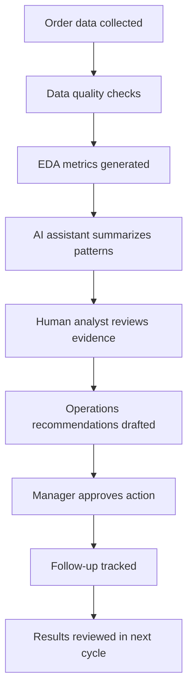

# Workflow Map

## Workflow Description

1. Order data is collected from the delivery platform.
2. Data quality checks identify missing ratings, duplicates, invalid values, or inconsistent categories.
3. EDA metrics summarize restaurant demand, cuisine demand, ratings, cost, preparation time, and delivery time.
4. The AI assistant translates metrics into plain-language observations and possible actions.
5. A human analyst reviews the evidence before recommendations are shared.
6. Operations managers decide which actions to take.
7. Follow-up actions are tracked so the team can measure improvement.

